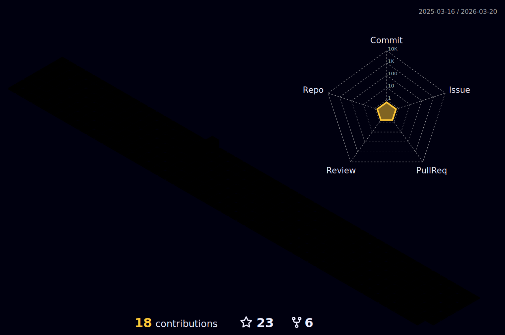

<h2  align="center">
[](https://git.io/typing-svg)    
</h2>
<!-- <h2  align="center">

<a  href="https://git.io/typing-svg">


</a>

</h2> -->

```python
class SriSaiCharan:

    def __init__(self):
        self.username = 'Sri-Sai-Charan'
        self.name = 'SriSaiCharan Velisetti'
        self.code = {
            'machine_learning': ['Keras', 'TensorFlow', 'Pytorch', 'Anaconda', 'Python','Mujoco','Isaac Sim'],
            'computer_vision':  ['OpenCV', 'Python', 'Matlab','Pygame'],
            'path_planning':  ['AStar', 'Dijkstra', 'RRT*','BFS'],
            'ros':              ['C++', 'Python', 'ROS 1', 'ROS 2', 'Gazebo',
                                    'RViz','SolidWorks','Catkin'],
            'programing_misc':  ['LabView','Simulink','Google Colab', 
                                    'Firebase', 'Ansys', 'Doxygen']
        }
        self.education = {
            'undergraduate':    ['University' : 'SRM IST',
                                 'Degree'     : 'Mechatronics'],
            'graduate':         ['University' : 'UMD College Park',
                                 'Degree'     : 'Robotics']
        }
        

    def __str__(self):
        return self.name

if __name__ == '__main__':
    me = SriSaiCharan()
```


[](https://www.linkedin.com/in/sri-sai-charan-v-4627ba173/)
[](mailto:svellise@umd.edu)
[](https://twitter.com/SaiCharan8912)


<a href="https://github.com/MartinHeinz/MartinHeinz">
  
</a>
<a href="https://github.com/MartinHeinz/MartinHeinz">
  
</a>     
<h3 align="left">Languages and Tools:</h3>
<p align="left"> <a href="https://developer.android.com" target="_blank" rel="noreferrer">  </a> <a href="https://www.arduino.cc/" target="_blank" rel="noreferrer">  </a> <a href="https://www.cprogramming.com/" target="_blank" rel="noreferrer">  </a> <a href="https://www.w3schools.com/cpp/" target="_blank" rel="noreferrer">  </a> <a href="https://www.w3schools.com/cs/" target="_blank" rel="noreferrer">  </a> <a href="https://www.docker.com/" target="_blank" rel="noreferrer">  </a> <a href="https://firebase.google.com/" target="_blank" rel="noreferrer">  </a> <a href="https://git-scm.com/" target="_blank" rel="noreferrer">  </a> <a href="https://www.w3.org/html/" target="_blank" rel="noreferrer">  </a> <a href="https://www.linux.org/" target="_blank" rel="noreferrer">  </a> <a href="https://www.mathworks.com/" target="_blank" rel="noreferrer">  </a> <a href="https://opencv.org/" target="_blank" rel="noreferrer">  </a> <a href="https://pandas.pydata.org/" target="_blank" rel="noreferrer">  </a> <a href="https://www.python.org" target="_blank" rel="noreferrer">  </a> <a href="https://pytorch.org/" target="_blank" rel="noreferrer">  </a> <a href="https://scikit-learn.org/" target="_blank" rel="noreferrer">  </a> <a href="https://www.tensorflow.org" target="_blank" rel="noreferrer">  </a> <a href="https://unity.com/" target="_blank" rel="noreferrer">  </a> <a href="https://unrealengine.com/" target="_blank" rel="noreferrer">  </a> </p>

<p></p>
